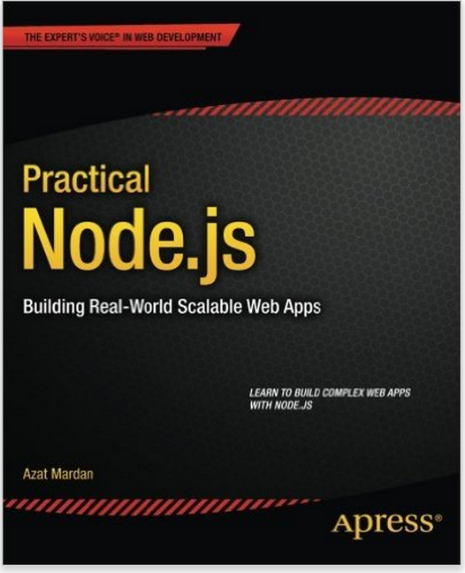
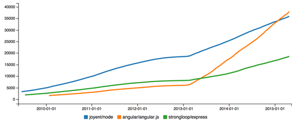
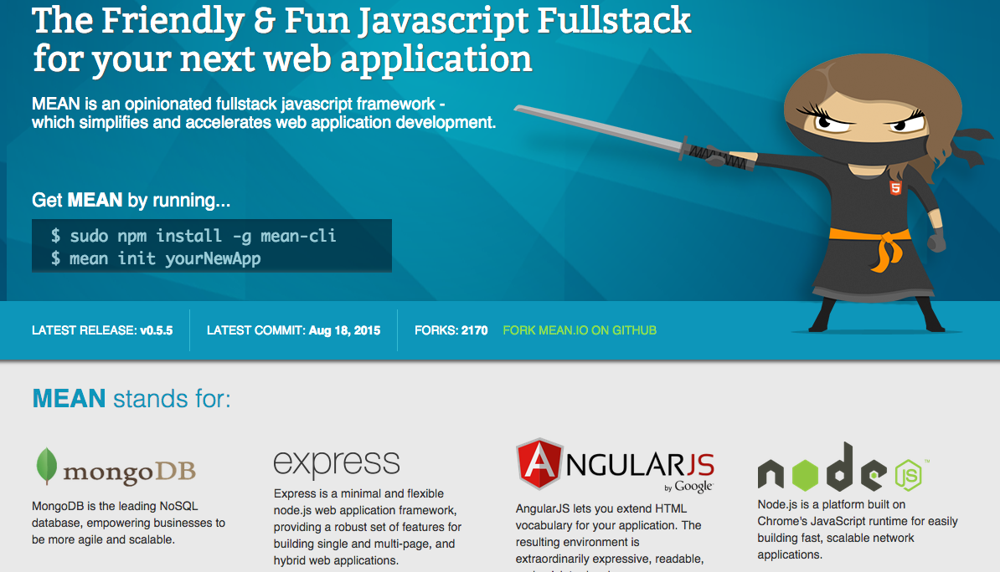
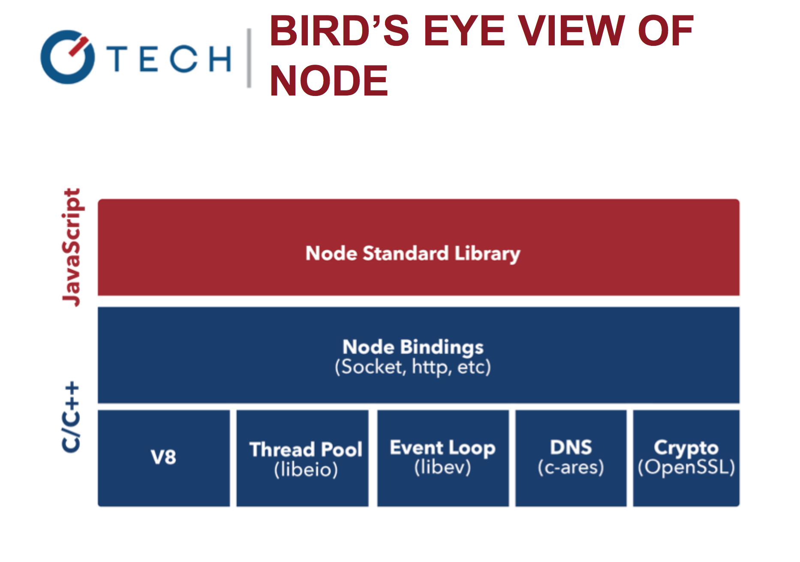
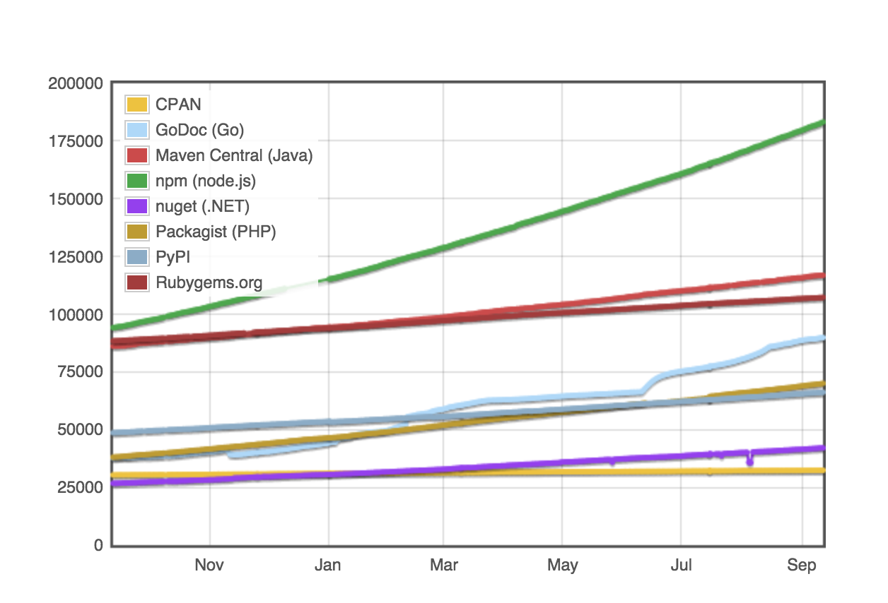
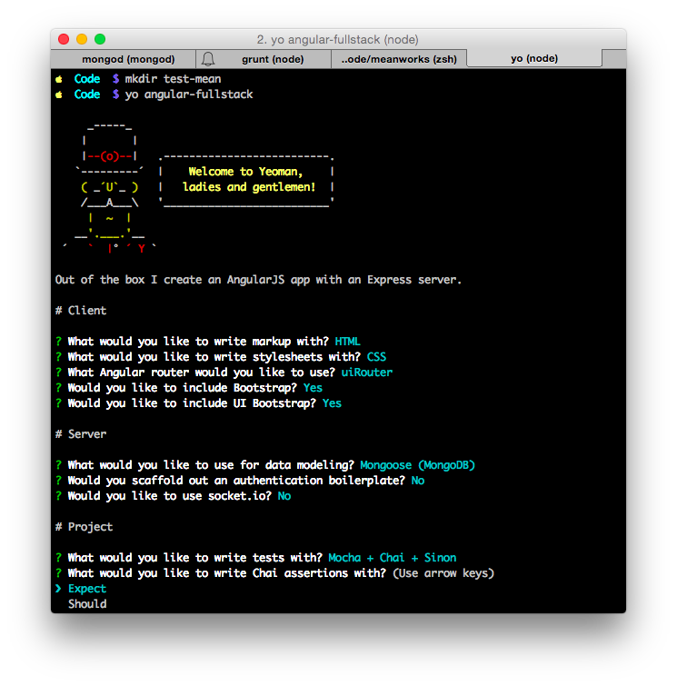
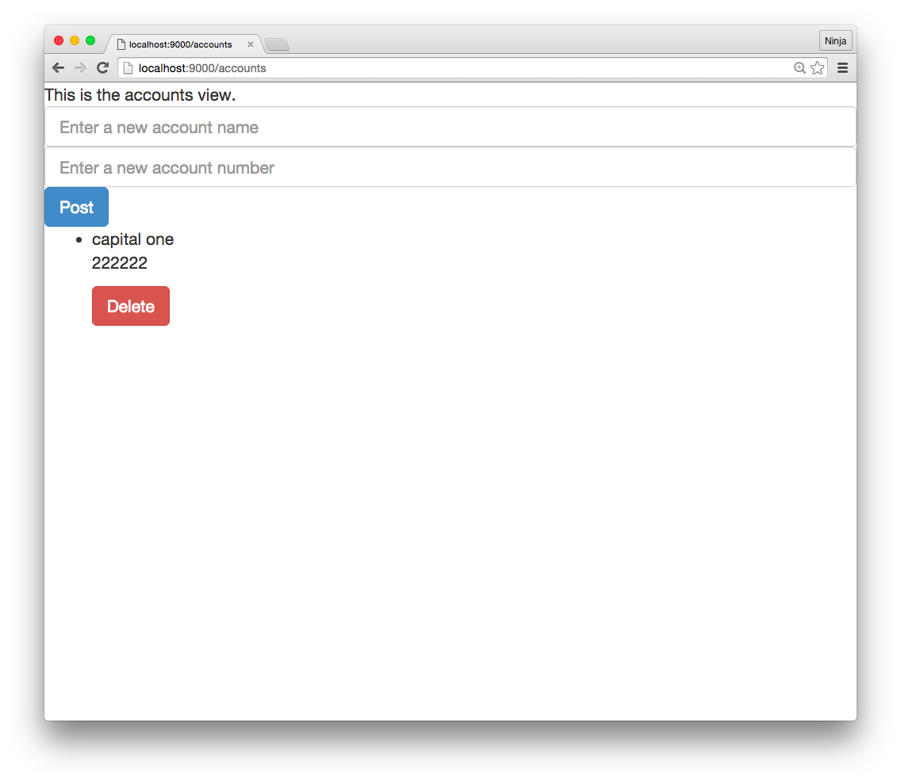
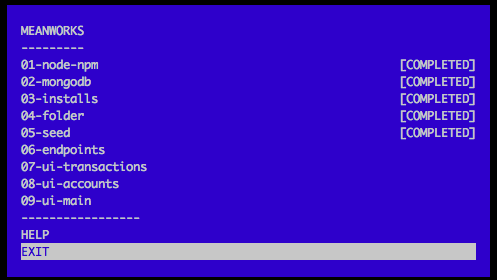

footer: © Capital One, 2015
slidenumbers: true

# MEANWorks: MongoDB/Mongoose, Express, Angular and Node Workshop with Angular Fullstack Generator

## Full Stack JavaScript


Node.js version: 5.1.0
Last updated: Jan 2016

---

# MongoDB, Express, Angular, and Node.js


---

# Agenda

* Quick Overview of MEAN (MongoDB, Express, Angular, and Node)
* MongoDB demo
* Express basics
* Angular and Full Stack Generator
* MEANWorks adventure demo

---

# Requirements

You'll need these (install them before proceeding):

* Node.js, npm and MongoDB
* Grunt, Yeoman, Full Stack Generator, webdriver
* Code editor (Sublime Text, Atom, etc.)—*IDEs are not recommended for this workshop*
* Command line app (Terminal, iTerm, etc.)
* Internet connection (duh!)
* Slides & sample code <https://github.com/azat-co/meanworks>

---

# Proxy for npm, Bower, Git, etc.

* npm: <https://docs.npmjs.com/misc/config>
* Bower: <http://bower.io/docs/config/>
* Git: <https://git-scm.com/docs/git-config>

Avoid storing plain passwords in the Git or npm configs.

---

# Setup Instructions

Detailed generic version: <https://github.com/azat-co/meanworks/blob/master/setup.pdf>

... and in the MEANWorks

---

# Requirements

You'll also need (we'll install them together in MEANWorks):

* Bower
* Grunt
* nodemon
* Mocha
* Express
* Yeoman

---

# Slides and Code

* Slides: <https://github.com/azat-co/meanworks/blob/master/slides>
* App: <https://github.com/azat-co/meanworks/blob/master/app>

---

# Downloading

Clone the repository (recommended):

```
$ git clone https://github.com/azat-co/meanworks
```

Navigate to slides:

```
$ cd meanworks/slides
$ open README.md
```

Or read in the browser:

<https://github.com/azat-co/meanworks/master/blob/slides/README.md>

---

# Introductions


Instructor: Azat Mardan

* Work: Capital One, Storify, FDIC, NIH, DocuSign, and others
* Blog: <http://webapplog.com>
* Books: React Quickly, Full Stack JavaScript, Practical Node.js, Pro Express.js, Mongoose Course

^Tell about yourself and find out about them

---





---

# Meet M.E.A.N.!

---


# Benefits of MEAN

* Rapid prototyping
* One language to rule them all!
* Vibrant community

---


---

# Rate of GitHub star growth for Node, Express and Angular



---

# Easy Peasy



---

# What is MEAN?

* MongoDB: NoSQL Database
* Express: Web HTTP server framework for REST API
* AngularJS: Front-end framework
* Node.js: Non-blocking I/O to power Express.js and connect to MongoDB

---

# MongoDB


* Document store NoSQL database
* Replication & High Availability
* Easy to scale and rapid prototyping
* Schema-less and no complex joins
* JavaScript interface

---

# Install MongoDB

<https://www.mongodb.org/downloads>

For Mac OS X:

```
$ brew install mongodb@3.0.6
```

---

# Launching MongoDB

Launch the `mongod` service with:

```
$ mongod
```

You should be able to see information in your terminal. The default port is 27017.

---

# MongoDB Shell (mongo)

For the MongoDB shell, or mongo, launch in a new terminal window (let the server run), this command:

```
$ mongo
```


---

# MongoDB Shell (mongo)

To test the database, use the JavaScript-like interface and commands save and find:

```
> db.test.save({a:1})
> db.test.find()
```

MongoDB uses JavaScript!


---

# MongoDB Shell (mongo)

Useful MongoDB Shell commands:

* `> help`
* `> show dbs`
* `> use board`
* `> show collections`
* `> db.messages.remove();`

---

# MongoDB Shell (mongo)

Useful MongoDB Shell commands:

* `> var a=db.messages.findOne();`
* `> print json(a);`
* `> a.message="hi";`
* `> db.messages.save(a);`
* `> db.messages.find({});`


---

# MongoDB Shell (mongo)

Useful MongoDB Shell commands:

* `> db.messages.update({name:"John"},{$set:{message:"bye"}});`
* `> db.messages.find({name:"John"});`
* `> db.messages.remove({name:"John"});`

---

# MongoDB Shell Demo

## Demo time! :ok_hand:

---

# MongoDB vs. MongoDB Native Driver

They are NOT the same! :confused:

---

# MongoDB Native Driver (mongodb)

Node.js Native Driver for MongoDB (https://github.com/christkv/node-mongodb-native)

```
$ npm install mongodb --save
```

---

# Establishing Connection

```js
var MongoClient = require('mongodb').MongoClient,
  assert = require('assert');

// Connection URL
var url = 'mongodb://localhost:27017/myproject';
// Use connect method to connect to the Server
MongoClient.connect(url, function(err, db) {
  assert.equal(null, err);
  console.log("Connected correctly to server");

  db.close();
});
```

---

# Inserting Documents

```js
collection.insert([
  {a : 1}, {a : 2}, {a : 3}
], function(err, result) {
  console.log("Inserted 3 documents into the document collection");
  callback(result);
});
```


---

# Updating Documents

```js
collection.update({ a : 2 }
  , { $set: { b : 1 } }, function(err, result) {
  console.log("Updated the document with the field a equal to 2");
  callback(result);
});  
```

---


# Removing Documents

```js
// Insert some documents
collection.remove({ a : 3 }, function(err, result) {
  console.log("Removed the document with the field a equal to 3");
  callback(result);
});
```


---

# Fetching Documents

```js
collection.find({}).toArray(function(err, docs) {
  console.log("Found the following records");
  console.dir(docs);
  callback(docs);
});

```

---


# AngularJS


---

# AngularJS

* Supported by Google
* Rapid prototyping (two-way binding)
* Feature rich, i.e., does a lot of things for developers
* De-emphasizes explicit DOM manipulation
* Separates presentation, data, and logic components

---

# Two-Way Binding

models->views
views->models

No DOM manipulations.

---

# Angular Structure

* Route file
* Templates
* Controllers


---

# Route

```js
angular.module('ngFullstackNewApp')
  .config(function($stateProvider) {
    $stateProvider
      .state('main', {
        url: '/',
        templateUrl: 'app/main/main.html',
        controller: 'MainController',
        controllerAs: 'main'
      });
  });
```

---

# Template

```html
<navbar></navbar>

<header class="hero-unit" id="banner">
  <div class="container">
    <h1>'Allo, 'Allo!</h1>
    <p class="lead">Kick-start your next web app with Angular Fullstack</p>
    
  </div>
</header>

<div class="container">
  <div class="row">
    <div class="col-lg-12">
      <h1 class="page-header">Features:</h1>
      <ul class="nav nav-tabs nav-stacked col-md-4 col-lg-4 col-sm-6" ng-repeat="thing in main.awesomeThings">
        <li><a href="#" tooltip="{{thing.info}}">{{thing.name}}</a></li>
      </ul>
    </div>
  </div>
</div>

<footer></footer>
```

---

# Controller

```js
(function() {

class MainController {

  constructor($http) {
    this.$http = $http;
    this.awesomeThings = [];

    $http.get('/api/things').then(response => {
      this.awesomeThings = response.data;
    });
  }

  addThing() {
    if (this.newThing) {
      this.$http.post('/api/things', { name: this.newThing });
      this.newThing = '';
    }
  }

  deleteThing(thing) {
    this.$http.delete('/api/things/' + thing._id);
  }
}

angular.module('ngFullstackNewApp')
  .controller('MainController', MainController);

})();
```

---


# Node.js


---

# Node.js

* Scalable, fast web platform
* Mature (v4.1 as of Sep '15) and supports a lot of ES6 features
* Allows for front-end code re-use on the server: lodash, underscore and vice versa

---

# Advantages of Node.js

* Non-blocking I/O
* Super fast (V8)
* Vibrant ecosystem (npm)
* Ability to re-use code on browser and server
* Ability to use front-end devs for back-end and vice versa

^The Event loop is the core of Node.js and it's a genius idea. But: Don't use Node.js for blocking, CPU-intensive tasks. Node.js is not suited for stuff like that. Node.js is suited for I/O stuff (like web servers).

---


# Node Core: V8, libev, and libeio

* Libev: The event loop
* LibEio: Async I/O
* LibUv: Abstraction on libEio, libev, c-ares (for DNS) & iocp (for Windows)

^It's written originally for `*`nix systems. Libev provides a simple yet optimized event loop for the process to run on. You can read more about libev here.  
It handles file descriptors, data handlers, sockets etc. You can read more about it here here.  
LibUv performs, mantains and manages all the io and events in the event pool. ( in case of libeio threadpool ). You should check out Ryan Dahl's tutorial on libUv. That will start making more sense to you about how libUv works itself and then you will understand how node.js works on the top of libuv and v8.

---



---

# Node Stack

* Core modules: http, fs, net, utils, query
* Web frameworks: Express, Hapi, Loopback, Sails
* Database drivers: mongodb (native Node.js MongoDB driver)
* Testing: Mocha, supertest and expect
* Dependency management: Bower and npm
* Building: Webpack, Grunt or Gulp

---

# Node Stack

* Authentication: passport
* Code generation: yo
* Process managers: pm2, strong-cluster-control, forever


---

# Node Console Demo

Let's play with Node! :open_hands:

---

# npm Rules



---

# Express.js


---

# Advantages of Express.js

* Easy to learn (configuration over convention)
* Myriads of modules
* Mature and the most popular (v4.x)

---

# Configuring Express

The Express server needs to be configured before it can start

Manage configuration via the `set` method:

```js
var app = express();
app.set('port', process.env.PORT || 3000);
app.set('views', 'views'); // the directory the templates are stored in
app.set('view engine', 'jade');
```

---

# Connect Framework

Express leverages the Connect framework to provide middleware
functionality.

Middleware are used to manage how a request should be handled.

<http://senchalabs.github.com/connect>

---

## Node.js Middleware Pattern

Middleware pattern is a series of processing units connected together, where the output of one unit is the input for the next one. In Node.js, this often means a series of functions in the form:

```js
function(args, next) {
  next(output) // error or real output
}
```

---

# Middleware Order

Middleware are executed in the order specified:

```js
app.use(express.logger('dev'));
app.use(express.basicAuth('test', 'pass'));
app.use(express.json());
```

---

# Creating Middleware

Custom middleware is easy to create:

```js
app.use(function (req, res, next) {
  // modify req or res
  // execute the callback when done
  next();
});
```

---

# Most Popular and Useful Connect/Express Middleware

`$ sudo npm install <package_name> --save`

* [body-parser](https://github.com/expressjs/body-parser) request payload
* [compression](https://github.com/expressjs/compression) gzip
* [connect-timeout](https://github.com/expressjs/timeout) set request timeout
* [cookie-parser](https://github.com/expressjs/cookie-parser) Cookies
* [cookie-session](https://github.com/expressjs/cookie-session) Session via Cookies store

---

# Connect/Express Middleware

* [csurf](https://github.com/expressjs/csurf) CSRF
* [errorhandler](https://github.com/expressjs/errorhandler) error handler
* [express-session](https://github.com/expressjs/session) session via in-memory or other store
* [method-override](https://github.com/expressjs/method-override) HTTP method override
* [morgan](https://github.com/expressjs/morgan) server logs
* [response-time](https://github.com/expressjs/response-time): response time

---

# Express.js Cheatsheet

<https://github.com/azat-co/cheatsheets/blob/master/express4/index.md>

---

# General MEAN Generators

* <http://meanjs.org/>
* <http://mean.io/#!/>
* <https://github.com/DaftMonk/generator-angular-fullstack>

---


# Angular Full Stack Generator

Yeoman generator for AngularJS with an Express server

<https://github.com/angular-fullstack/generator-angular-fullstack>


---

# Generator Components

* MongoDB (Mongoose) or SQL databases (Sequelize)
* Express
* Auth (Google, Facebook, etc.)
* Socket.io
* Jasmine or Mocha tests
* Twitter Bootstrap UI

---

```
$ npm install -g yo grunt-cli bower generator-angular-fullstack
$ mkdir my-new-project && cd $_
$ yo angular-fullstack [app-name]
```

---

```
# Client

? What would you like to write markup with? (Use arrow keys)
❯ HTML
  Jade
```

---

```
? What would you like to write stylesheets with?
❯ CSS
  Sass
  Stylus
  Less
```

---

```
? What Angular router would you like to use? (Use arrow keys)
  ngRoute
❯ uiRouter
```

---

```
? Would you like to include Bootstrap? (Y/n) Y
```

---

```
? Would you like to include UI Bootstrap? (Y/n) Y
```

---

```
# Server

? What would you like to use for data modeling? (Press <space> to select)
❯◉ Mongoose (MongoDB)
 ◯ Sequelize (MySQL, SQLite, MariaDB, PostgreSQL)
```

---

```
? Would you scaffold out an authentication boilerplate? (Y/n) n
```

---

```
? Would you like to use socket.io? (Y/n) n
```

---

```
# Project

? What would you like to write tests with? (Use arrow keys)
  Jasmine
> Mocha + Chai + Sinon
```

---

```
? What would you like to write Chai assertions with? (Use arrow keys)
❯ Expect
  Should
```

---




---


```
  create bower.json
  create package.json
  create .gitignore
  create .bowerrc
  create .buildignore
  create .editorconfig
  create .gitattributes
  create .jscsrc
  create .travis.yml
```

---

```  
  create client/.htaccess
  create client/.jshintrc
  create client/app/app.js
  create client/app/app.css
  create client/app/main/main.controller.js
  create client/app/main/main.controller.spec.js
  create client/app/main/main.js
  create client/app/main/main.css
  create client/app/main/main.html
  create client/assets/images/yeoman.png
```

---

```  
  create client/components/footer/footer.directive.js
  create client/components/footer/footer.css
  create client/components/footer/footer.html
  create client/components/modal/modal.service.js
  create client/components/modal/modal.css
  create client/components/modal/modal.html
  create client/components/navbar/navbar.controller.js
  create client/components/navbar/navbar.directive.js
  create client/components/navbar/navbar.html
  create client/components/ui-router/ui-router.mock.js
  create client/components/util/util.module.js
  create client/components/util/util.service.js
  create client/favicon.ico
  create client/index.html
  create client/robots.txt
```

---

```  
  create e2e/components/navbar/navbar.po.js
  create e2e/main/main.po.js
  create e2e/main/main.spec.js
  create Gruntfile.js
  create karma.conf.js
  create mocha.conf.js
  create protractor.conf.js
  create README.md
```

---

```  
  create server/.jshintrc
  create server/.jshintrc-spec
  create server/app.js
  create server/components/errors/index.js
  create server/config/local.env.js
  create server/config/local.env.sample.js
  create server/config/environment/development.js
  create server/config/environment/index.js
  create server/config/environment/production.js
  create server/config/environment/shared.js
  create server/config/environment/test.js
  create server/config/express.js
  create server/config/seed.js
  create server/index.js
  create server/routes.js
  create server/views/404.html
  create server/api/thing/thing.controller.js
  create server/api/thing/thing.events.js
  create server/api/thing/thing.integration.js
  create server/api/thing/thing.model.js
  create server/api/thing/index.js
  create server/api/thing/index.spec.js
```

---

# Generator Demo!

It's demo time! :telescope: :computer: :ok_hand:

```
$ cd app
$ grunt serve
```

<http://localhost:9000/>

---

# Workshop!

🐥

---

# Project

Use MEANWorks to verify versions and build the project app:

1. Build REST API
1. Build Angular app with Full Stack Generator
1. Create CRUD for accounts


---

# The App



---

# App Demo

It's demo time! :telescope: :computer: :ok_hand:

App: <https://github.com/azat-co/tree/master/app>

Running the app, i.e., official solution to MEANWorks (optional, because you'll be building your own):

<https://github.com/azat-co/tree/master/app/readme.md>

---


# Project Structure

```
/node_modules
/e2e
/server
/client
index.js
package.json
npm-shrinkwrap.json
readme.md
test.js
transactions.json
accounts.json
```

^Describe each folder

---

# Local Setup

Create a new folder:

```
$ mkdir mean
```

Test if you have Node.js, MongoDB, npm and git:

```
$ node -v
$ npm -v
$ mongod --version
$ git --version
```

---

# Installation


```
$ npm install -g yo grunt-cli generator-angular-fullstack
```

---

# Project Init

```
$ cd mean
$ yo angular-fullstack
```

---

# Endpoints and Routes

```
$ yo angular-fullstack:endpoint account
$ yo angular-fullstack:route accounts
```

Answer questions

---

# Test First

test.js:

```js
var supertest = require('supertest'),
  id = null,
  url = 'http://localhost:3000'

describe('GET /transactions', function(){
  it('responds with json', function(done){
    supertest(url)
      .get('/api/transactions')
      .expect(200, done)
  })
})
```

---

# Running the Test

In terminal:

```
$ ./node_modules/mocha/bin/mocha test.js
```

---

# Express App

```js
var express = require('express'),
  bodyParser = require('body-parser'),
  errorHandler = require('errorhandler'),
  app = express(),
  mongo = require('mongodb'),
  cors = require('cors')

app.use(cors({
  origin: 'http://localhost:8080'
}))
app.use(bodyParser.json())
app.use(express.static('public'))
...
```

---

# MongoDB Connection

```js
...
var url = 'mongodb://localhost:27017/mean';

mongo.connect(url, function(err, db) {
  if (err) {
    console.error(err)
    return process.exit(1)
  }
  var transactionsCollection = db.collection('transactions')
  ...
```

---

# GET `/api/transaction`

```js
...
  app.get('/api/transactions', function(req, res, next){
    transactionsCollection.find({}, {sort: {_id:-1}}).toArray(function(error, transactions){
      if (error) return next(error)
      console.log(transactions)
      return res.send(transactions)
    })
  })
})
...
```

---

# Startup

```js
...
app.use(errorHandler())

app.listen(3000)
...
```

---

# Starting the Server

In terminal:

```
$ node ./node_modules/nodemon/bin/nodemon.js index.js
```

---

# Seeding the Database

Use this command in terminal to populate the `transactions` collection in the database `mean` with transactions:

```
$ mongoimport  --host=127.0.0.1 --port=27017 --db mean --collection transactions --file transactions.json --jsonArray
$ mongoimport  --host=127.0.0.1 --port=27017 --db mean --collection accounts --file accounts.json --jsonArray
```


transaction.json: <https://github.kdc.capitalone.com/secollege/mean/raw/master/code/transactions.json>
accounts.json: <https://github.kdc.capitalone.com/secollege/mean/raw/master/code/accounts.json>

---

# Checking Seed Data

Check the data in the mongo shell:

```
> use mean
> db.transactions.find({})
```

---


# Running App

Open this URL in Chrome, Firefox or Safari:

<http://localhost:9000/accounts>

---


# Icon Styles

<https://fortawesome.github.io/Font-Awesome/examples/>

---

TK

---

# Questions :confused::question::grin:

---


# Adventure Time! :steam_locomotive:



---

# Installation

```
$ git clone https://github.kdc.capitalone.com/secollege/meanworks.git
$ cd meanworks
$ npm install
$ npm link
```

For Windows: You'll need Python from .NET package.

---

# MEANWorks Usage

* `$ meanworks` or `node meanworks.js`: launch menu to select the adventure and monitor progress
* `$ meanworks verify`: verify solution
* `$ meanworks verify YOUR_FILE_NAME`: to verify that you have finished an exercise with a filename
* `$ meanworks help`: to get help with the workshop
* `$ meanworks print`: to re-display the current exercise

---


# MEANWorks Usage

* `$ meanworks solution`: to show the solution for the current exercise
* `$ meanworks verify skip` to skip it.

---

# MEANWorks Adventures

1. node&npm
1. mongodb
1. installs: bower, grunt, yo, generator, webdriver
1. folder

---

# MEANWorks Adventures

8. seed
9. GET /accounts
10. GET /transactions

---


# MEANWorks Adventures

1. ui form
1. ui table
1. crud-api
1. crud-ui

---

# MEANWorks Demo

It's demo time! :telescope: :computer: :ok_hand:

First adventure: install compatible version of Node.js (5.1.0).

---

# Exercise

It's time to build the app by solving adventures!

1. Run `$ node meanworks` in your terminal.
1. Solve adventures one-by-one starting from the top.
1. Have fun.

Use command to run, verify or look the official solution.

---

# Feedback

Bugs? Send them to me. I 😋 them for breakfast!

:bug::bug::bug: :point_right: <https://github.com/azat-co/meanworks/issues>

You are :star:!

---

# Workshop Time

🔨

```
$ node meanworks
```
